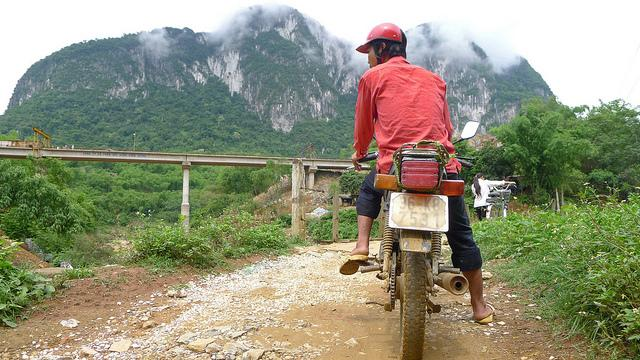
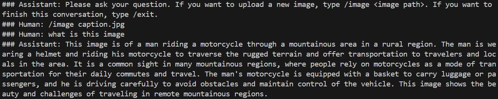

# LLaVA-from-scratch

A complete implementation of LLaVA (Large Language and Vision Assistant) from scratch, featuring a two-stage training pipeline and inference capabilities.

<br></br>

## 🔍 Overview

### Background of LLaVA Research

[LLaVA](https://llava-vl.github.io/) (Large Language and Vision Assistant) is a groundbreaking research presented at NeurIPS 2023, introducing the innovative approach of **Visual Instruction Tuning**. The key innovations of this research include:

- **Efficient Multimodal Learning**: Integrates vision and language understanding by combining existing large language models (LLMs) with pre-trained Vision Encoders, eliminating the need for training from scratch
- **Simple Architecture**: An elegant and effective design that connects visual and language features with just a 2-layer MLP projection layer
- **Instruction-Following Capabilities**: Leverages high-quality visual instruction data generated by GPT-4 to acquire the ability to answer complex questions about images and generate detailed descriptions
- **Cost Efficiency**: Achieves high performance with minimal resources by training only the projection layer and LoRA adapters instead of the full model

### Significance of This Repository

This repository provides a complete educational and research codebase implementing LLaVA from scratch:

- **Complete Implementation**: Faithfully reproduces the paper's two-stage training methodology, fully executable from projector pre-training to final fine-tuning
- **Practical Memory Optimization**: Implements optimization techniques that work under real GPU constraints, including Gradient Checkpointing, LoRA, and Gradient Accumulation
- **Educational Code Structure**: Each component is clearly separated, making it ideal as a starting point for learning and researching multimodal AI
- **Ready to Use**: Provided in a ready-to-run state, from dataset download to model training and inference

### Models and Data

- **Vision Encoder**: CLIP ViT-L/14@336px (OpenAI) - Transforms images into high-dimensional feature vectors
- **Language Model**: Llama-3.2-1B-Instruct (Meta) - A compact instruction-tuned language model
- **Projection Layer**: 2-layer MLP - Aligns visual feature space with language feature space

### Training Strategy

Achieves efficient learning through a two-stage approach:

1. **Stage 1 (Projector Pre-training)**: Pre-trains the projection layer on the CC3M dataset (3 million image-caption pairs) to connect vision and language modalities
2. **Stage 2 (Instruction Tuning)**: Trains on the LLaVA-Instruct-150K dataset for complex question answering and reasoning tasks about images

<br></br>

## 🏗️ Architecture

```
┌────────────────────────────────────────────────────────────────┐
│                        LLaVA Model                             │
├────────────────────────────────────────────────────────────────┤
│                                                                │
│  ┌──────────┐       ┌──────────┐       ┌──────────────┐        │
│  │  Image   │       │          │       │              │        │
│  │(336x336) │─────> │   CLIP   │──────>│  Projector   │        │
│  │          │       │  ViT-L   │       │  (2-layer)   │        │
│  └──────────┘       │ (frozen) │       │     MLP      │        │
│                     └──────────┘       └──────┬───────┘        │
│                                               │                │
│  ┌──────────┐                                 │                │
│  │   Text   │                                 ▼                │
│  │  Tokens  │                        ┌────────────────┐        │
│  │          │───────────────────────>│  Concatenate   │        │
│  └──────────┘                        │  (Combined     │        │
│                                      │   Embeddings)  │        │
│                                      └───────┬────────┘        │
│                                              │                 │
│                                              ▼                 │
│                                      ┌───────────────┐         │
│                                      │  Llama 3.2    │         │
│                                      │ 1B-Instruct   │         │
│                                      │    (LoRA)     │         │
│                                      └───────┬───────┘         │
│                                              │                 │
│                                              ▼                 │
│                                      ┌───────────────┐         │
│                                      │    Output     │         │
│                                      └───────────────┘         │
│                                                                │
└────────────────────────────────────────────────────────────────┘
```

### Key Components

1. **Vision Encoder (CLIP ViT-L)**: Converts images into 1024-dim feature vectors (frozen)
2. **Projector (2-layer MLP)**: Aligns vision features with language model space (1024→2048 dims)
3. **Language Model (Llama-3.2-1B)**: Generates text from combined image+text embeddings (LoRA fine-tuned)

<br></br>

## ✨ Features

- **Complete Training Pipeline**: Two-stage training from scratch
- **Memory Efficient**: Gradient checkpointing, LoRA, gradient accumulation
- **Streaming Data Loading**: WebDataset for CC3M, streaming for LLaVA-Instruct-150K
- **Flexible Inference**: Easy-to-use inference script with customizable prompts
- **Validation & Early Stopping**: Built-in validation with early stopping
- **Mixed Precision Training**: FP16 automatic mixed precision support

<br></br>

## 🚀 Installation

### 1. Clone the repository

```bash
git clone https://github.com/Hiroaki-K4/LLaVA-from-scratch.git
cd LLaVA-from-scratch
```

### 2. Install dependencies

Using [uv](https://github.com/astral-sh/uv) (recommended):

```bash
uv sync
```

Or using pip:

```bash
pip install -r requirements.txt
```

<br></br>

## 🎯 Quick Start

### Complete Training Workflow

```bash
# Stage 1: Train the projection layer (4-6 hours on single GPU)
uv run python train_projector.py

# Stage 2: Train the full LLaVA model with LoRA (8-12 hours on single GPU)
uv run python train_llava.py

# Run inference
uv run python infer.py
```

Below are the inference results from our LLaVA model trained in this repo. As shown, the model can accurately describe the input image.





<br></br>

## 🎓 Training

### Stage 1: Projector Training

The first stage trains only the projection layer to align CLIP vision features with the language model's embedding space.

**Dataset**: CC3M (Conceptual Captions 3M)
- 3M image-caption pairs from web
- Delivered via WebDataset streaming

**Command**:
```bash
uv run python train_projector.py
```

**Key Parameters** (edit in `train_projector.py`):
```python
llm_id = "meta-llama/Llama-3.2-1B-Instruct"
vision_id = "openai/clip-vit-large-patch14-336"
batch_size = 32
num_epochs = 1
lr_rate = 1e-3
gradient_accumulation_steps = 4
```

**Output**: `best_projector.pth` (trained projection layer weights)

**Training Details**:
- Vision encoder (CLIP) and language model (Vicuna) are frozen
- Only the 2-layer MLP projector is trained
- Uses image-caption pairs from CC3M
- Random instruction prompts for diversity
- Validation every 1000 steps with early stopping

### Stage 2: Full Model Training

The second stage fine-tunes the full model on instruction-following data using LoRA.

**Dataset**: LLaVA-Instruct-150K
- 150K multimodal instruction-following samples
- Images from COCO dataset
- Complex reasoning and conversation tasks

**Command**:
```bash
uv run python train_llava.py
```

**Key Parameters** (edit in `train_llava.py`):
```python
llm_id = "meta-llama/Llama-3.2-1B-Instruct"
vision_id = "openai/clip-vit-large-patch14-336"
projector_path = "best_projector.pth"
batch_size = 2
num_epochs = 1
lr_rate = 1e-5
gradient_accumulation_steps = 2  # Effective batch size = 4
```

**Output**: `best_llava/` (directory containing PEFT adapter weights)

**Training Details**:
- Vision encoder and base LM remain frozen
- LoRA adapters (rank=8) applied to q_proj and v_proj
- Gradient checkpointing enabled for memory efficiency
- Gradient accumulation with effective batch size of 4
- FP16 mixed precision training
- Validation every 1000 steps with early stopping (patience=3)
- Projector reloaded and fine-tuned alongside LoRA adapters

<br></br>

## 🔮 Inference

Use the trained model to generate responses for images.

**Command**:
```bash
uv run python infer.py
```

**Interactive Usage**:
The inference script provides an interactive chat interface:

```bash
uv run python infer.py
```

```
### Assistant: Please ask your question. If you want to upload a new image, type /image <image path>. If you want to finish this conversation, type /exit.
### Human: /image your_image.jpg
### Human: What is happening in this image?
### Assistant: [Model's response here]
### Human: /exit
```

**Technical Details**:
```python
llm_model_name = "meta-llama/Llama-3.2-1B-Instruct"
vision_model_name = "openai/clip-vit-large-patch14-336"
projector_path = "best_projector.pth"
llava_model_path = "best_llava"  # Directory containing PEFT adapter
```

**Generation Parameters** (in `generate_response` function):
- `max_new_tokens=512`: Maximum response length
- Uses greedy decoding by default for consistent outputs
- Combined embeddings (image + text) passed to language model

<br></br>

## 📊 Dataset Information

### CC3M (Conceptual Captions 3M)

- **Purpose**: Stage 1 projector training
- **Size**: 3+ million image-caption pairs
- **Format**: WebDataset (.tar files)
- **Source**: https://huggingface.co/datasets/pixparse/cc3m-wds
- **Loading**: Streaming via WebDataset (no local storage needed)

### LLaVA-Instruct-150K

- **Purpose**: Stage 2 instruction tuning
- **Size**: 150K instruction samples
- **Format**: JSON with conversation-style data
- **Source**: https://huggingface.co/datasets/liuhaotian/LLaVA-Instruct-150K
- **Images**: From COCO dataset (auto-downloaded)
- **Loading**: Streaming for training, cached for validation

<br></br>

## 🧠 Memory Optimization

This implementation includes several memory optimization techniques:

### 1. Gradient Accumulation
```python
GRADIENT_ACCUMULATION_STEPS = 4
# Effective batch size = BATCH_SIZE × GRADIENT_ACCUMULATION_STEPS
# Allows larger effective batch with less memory
```

### 2. Gradient Checkpointing
```python
model.language_model.gradient_checkpointing_enable()
# Trades compute for memory (40-50% reduction)
```

### 3. LoRA (Low-Rank Adaptation)
```python
lora_config = LoraConfig(
    r=8,  # Rank of LoRA matrices
    lora_alpha=32,
    target_modules=["q_proj", "v_proj"]
)
# Only trains small adapter layers (~0.5% of parameters)
```

### 4. Mixed Precision (FP16)
```python
with torch.amp.autocast("cuda", dtype=torch.float16):
    outputs = model(...)
# Reduces memory usage by 50% with minimal accuracy loss
```

### 5. Frozen Encoders
- Vision encoder (CLIP) remains frozen
- Base language model remains frozen
- Only projector and LoRA adapters are trained

### 6. Dtype Consistency
```python
# All model components use float16 for consistency
self.vision_encoder = CLIPVisionModel.from_pretrained(
    vision_model_name, dtype=torch.float16
)
self.language_model = AutoModelForCausalLM.from_pretrained(
    llm_model_name, dtype=torch.float16, low_cpu_mem_usage=True
)
self.projector = self.projector.to(torch.float16)  # Critical for inference
```

**If you encounter OOM errors**:
1. Reduce `batch_size` (try 1 for Stage 2)
2. Increase `gradient_accumulation_steps`
3. Reduce validation frequency
4. The current setup uses Llama-3.2-1B which is already quite compact

<br></br>

## 🔧 Key Implementation Details
1. **Projector dtype conversion**: The projector is explicitly converted to float16 after loading to match the vision encoder's output dtype
2. **PEFT adapter storage**: Stage 2 outputs a directory (`best_llava/`) containing LoRA adapter weights, not a single `.pth` file
3. **Streaming datasets**: Both CC3M and LLaVA-Instruct use streaming to avoid downloading full datasets
4. **System prompt**: Uses the standard LLaVA system message for instruction formatting

<br></br>

## 📚 References
- **LLaVA Paper**: [Visual Instruction Tuning](https://arxiv.org/abs/2304.08485)
- **Original Implementation**: https://github.com/haotian-liu/LLaVA
- **Llama 3.2 Model**: https://huggingface.co/meta-llama/Llama-3.2-1B-Instruct
- **CLIP Vision**: https://huggingface.co/openai/clip-vit-large-patch14-336
- **LoRA Paper**: [Low-Rank Adaptation of Large Language Models](https://arxiv.org/abs/2106.09685)
- **PEFT Library**: https://github.com/huggingface/peft
